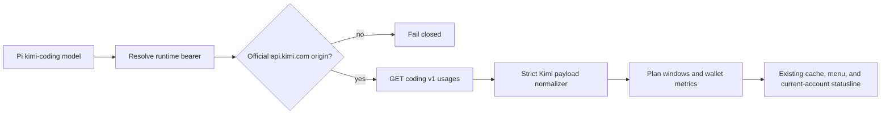

# Add Kimi For Coding support to pi-usage

## Goal

Add source-backed Kimi Coding Plan usage reporting to `@narumitw/pi-usage` for Pi provider ID `kimi-coding`, using the active runtime credential only at the official Kimi origin.

This plan covers only the Kimi For Coding portion of [issue #1051](https://github.com/narumiruna/pi-extensions/issues/1051).

## Context

Pi uses provider ID `kimi-coding`, inference base URL `https://api.kimi.com/coding`, and Bearer authentication for Kimi For Coding.

Kimi's first-party implementation queries `GET https://api.kimi.com/coding/v1/usages` with the same managed-provider bearer and distinguishes plan windows from booster-wallet currency values.

Authoritative evidence to revalidate:

- Pi provider and OAuth behavior: [`earendil-works/pi@e868230`](https://github.com/earendil-works/pi/tree/e86823096c5bad39e1ca282ec24bc5eb9bec745b), especially [`kimi-coding.ts`](https://github.com/earendil-works/pi/blob/e86823096c5bad39e1ca282ec24bc5eb9bec745b/packages/ai/src/providers/kimi-coding.ts) and [`auth/oauth/kimi-coding.ts`](https://github.com/earendil-works/pi/blob/e86823096c5bad39e1ca282ec24bc5eb9bec745b/packages/ai/src/auth/oauth/kimi-coding.ts).
- Kimi's first-party usage implementation: [`MoonshotAI/kimi-code@cd7c97b`](https://github.com/MoonshotAI/kimi-code/tree/cd7c97b377a77f7ae1b9d541cafe314e986ec074), especially [`managed-usage.ts`](https://github.com/MoonshotAI/kimi-code/blob/cd7c97b377a77f7ae1b9d541cafe314e986ec074/packages/oauth/src/managed-usage.ts) and its [tests](https://github.com/MoonshotAI/kimi-code/blob/cd7c97b377a77f7ae1b9d541cafe314e986ec074/packages/oauth/test/managed-usage.test.ts).

Applicable extension rules and verification methods:

- Authentication and transport **MUST** resolve fresh Pi runtime auth, require the official HTTPS origin, reject redirects and proxies, bound response bodies and time, and redact secrets; verify with adapter transport tests and review.
- Asynchronous work **MUST** cancel on dismissal, disposal, session replacement, and shutdown, and reject stale continuations after every `await`; verify with lifecycle and account-change tests plus review.
- `/usage` **MUST** retain its no-argument TUI/RPC menu and observable print/JSON rejection; verify with existing command-mode tests and Kimi menu tests.
- Status ownership **MUST** use the existing `usage` key only for the current Kimi account and clear it on model change, replacement, and shutdown; verify with lifecycle and statusline tests.
- Untrusted labels and errors **MUST** be terminal-sanitized at display boundaries; verify with hostile and oversized fixture tests.
- Published behavior **MUST** include README and metadata updates, a minor Changeset, deterministic tests, both repository gates, package build, dry-run pack, and Pi loader smoke; verify through review and the commands below.
- `docs/extension-settings.md` is not applicable because this work must not add or change extension-owned settings or persistence.

## Architecture

`packages/pi-usage/src/query.ts` owns origin validation, runtime authentication, bounded transport, adapter registration, and lifecycle-safe query integration.

`packages/pi-usage/src/providers/kimi-coding.ts` owns strict payload validation and conversion into `UsageReport`.

`packages/pi-usage/src/format.ts` keeps request windows and currency metrics visually and semantically distinct.

## Non-Goals

- Do not add Radius or xAI support in this change.
- Do not enumerate Kimi accounts or read Kimi CLI credential files.
- Do not support custom or proxy origins.
- Do not add Kimi-specific commands, `/usage` arguments, settings, persistence, or custom TUI components.
- Do not present booster-wallet currency as plan requests or quota percentages.

## Unknowns

- Current upstream must confirm that OAuth and API-key Kimi Coding credentials still use the same official managed usage endpoint.
- A disposable live account may be unavailable, so the endpoint smoke can remain explicitly unverified if deterministic source-derived tests pass.
- Unknown future window units or duplicate buckets must remain unavailable rather than being assigned invented semantics.

## Risks

- Provider schema drift could mislabel plan windows, so parsing must reject malformed and unknown values without inventing reset times.
- A proxy-resolved credential could leak if endpoint validation uses only provider ID, so the effective runtime origin must be checked before fetch.
- Currency fixed-point conversion could lose precision or be mistaken for request counts, so source-derived fixtures and distinct report metrics are required.
- A stale account query could enter cache or status output unless auth fingerprints and session guards are revalidated after asynchronous work.

## Plan

- [ ] Revalidate the pinned Pi and Kimi source revisions against current upstream and record the selected commits, provider ID, auth behavior, official origin, endpoint, response types, and fixed-point wallet conversion in an adjacent implementation comment and `packages/pi-usage/README.md`; verify by linking every reviewed source and stopping if the managed usage contract has materially changed.
- [ ] Add sanitized fixtures derived from Kimi's first-party managed-usage tests for weekly, five-hour, daily, malformed, and booster-wallet responses; verify fixtures contain no real credentials or account data and cover numeric strings, missing fields, duplicate windows, unknown units, invalid timestamps, hostile labels, and empty display data.
- [ ] Add `packages/pi-usage/src/providers/kimi-coding.ts` and extend `packages/pi-usage/src/types.ts` to normalize non-negative integer counts, source-defined windows, valid reset timestamps, sanitized labels, and fixed-point booster-wallet values into distinct buckets and metrics; verify with `packages/pi-usage/test/kimi-coding.test.ts` that malformed values fail or remain unavailable without invented semantics.
- [ ] Update `packages/pi-usage/src/query.ts` to register `kimi-coding`, query only `https://api.kimi.com/coding/v1/usages`, and accept the freshly resolved runtime bearer only when the effective origin is official; verify OAuth and API-key success plus custom, proxy, missing-auth, account-change, redirect, timeout, cancellation, oversized-body, malformed-JSON, and redacted-error cases.
- [ ] Update `packages/pi-usage/src/format.ts` and `packages/pi-usage/src/index.ts` to render Kimi plan windows and booster-wallet currency separately and publish a compact current-account statusline such as `kimi 99% 5h 96% wk`; verify remaining percentages, reset labels, hostile text sanitization, and unavailable fields with focused formatter tests.
- [ ] Extend `packages/pi-usage/test/usage.test.ts` to include current and configured Kimi accounts in the existing menu and all-provider flow while preserving bounded concurrency, partial failures, cache isolation, cancellation, account switching, stale-context rejection, and status cleanup; verify existing TUI/RPC behavior and print/JSON rejection remain unchanged.
- [ ] Update `packages/pi-usage/README.md` and `packages/pi-usage/package.json` with Kimi support, provider ID, official endpoint, plan and wallet semantics, auth behavior, origin restriction, displayed fields, and statusline examples; verify README structure with the fenced-code-aware heading audit from `docs/readme-conventions.md` and review metadata against implementation.
- [ ] Add a minor Changeset for `@narumitw/pi-usage` describing Kimi Coding Plan usage support; verify with `npm exec changeset status`.
- [ ] Audit the final diff against `docs/extension-conventions.md`, `docs/readme-conventions.md`, and the non-applicability of `docs/extension-settings.md`, including cancellation, disposal, session replacement, shutdown, stale state after every `await`, origin validation, terminal sanitization, status ownership, and package boundaries; record deviations and unavailable live checks in the handoff.
- [ ] Run `npm test -- packages/pi-usage/test/kimi-coding.test.ts packages/pi-usage/test/usage.test.ts packages/pi-usage/test/core.test.ts packages/pi-usage/test/generated-entry.test.ts`, then `npm run check` and `npm test`; verify all deterministic gates pass within the repository's 5,000 ms per-test limit.
- [ ] Run `npm --workspace @narumitw/pi-usage run build`, `just pack usage`, and `pi --no-extensions --no-skills -e ./packages/pi-usage --list-models`; verify generated imports resolve, the tarball contains only declared files, and Pi loads the package without an external usage request.
- [ ] When an approved disposable Kimi account is available, run one live `/usage` smoke against the official endpoint and record the source-backed fields shown for that exact account; verify secrets remain absent, or leave this smoke open and explicitly unverified rather than substituting undocumented behavior.

## Rollback / Recovery

No user data or settings migration is involved.

Before release, revert the Kimi adapter, tests, documentation, metadata, and Changeset together if source review or deterministic gates fail.

After release, remove `kimi-coding` from `SUPPORTED_ADAPTERS` in a patch release if the official contract becomes incompatible, and document the provider change in the release Changeset.

## Completion Checklist

- [ ] Current upstream confirms a stable first-party Kimi managed usage source and its authentication and response semantics.
- [ ] `/usage` displays source-backed weekly and returned sub-window usage, remaining values, and reset information for the exact runtime account.
- [ ] Booster-wallet currency remains separate from plan limits in types, normalization, formatting, tests, and documentation.
- [ ] OAuth and API-key runtime credentials remain cache-isolated, and custom or proxy origins fail before network access.
- [ ] Cancellation, partial failures, account changes, stale contexts, terminal sanitization, status publication, and status cleanup have deterministic regression coverage.
- [ ] The README, metadata, exports, tests, and minor Changeset agree with the implemented behavior.
- [ ] Focused tests, `npm run check`, `npm test`, package build, dry-run pack, and Pi loader smoke pass with evidence recorded in the handoff.
- [ ] The approved live smoke passes, or its absence is explicitly accepted and recorded as the only unverified path before release.
