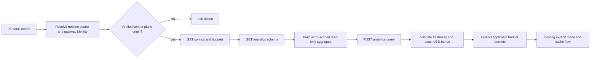

# Add Radius support to pi-usage

## Goal

Add source-backed Radius spending and budget reporting to `@narumitw/pi-usage` for Pi provider ID `radius` only after a mandatory live discovery gate proves the usage contract, actor scope, budget applicability, and safe gateway origin.

This plan covers only the Radius portion of [issue #1051](https://github.com/narumiruna/pi-extensions/issues/1051).

## Context

Pi supports the built-in Radius gateway at `https://radius.pi.dev` and custom gateways declared with `oauth: "radius"`.

The model inference `baseUrl` can come from gateway-returned config and does not necessarily identify the OAuth control-plane gateway.

Radius's current public contract exposes `GET /v1/context`, `GET /v1/budgets`, `GET /v1/analytics/schema`, and `POST /v1/analytics/query`, but no one-shot `/v1/usage` endpoint.

`GET /v1/budgets` reports configured USD-nano limits without consumption, so remaining budget must not be displayed until actor-scoped analytics, period boundaries, applicability, and export freshness are proven.

Authoritative evidence to revalidate:

- Pi provider behavior: [`earendil-works/pi@e868230`](https://github.com/earendil-works/pi/tree/e86823096c5bad39e1ca282ec24bc5eb9bec745b), especially [`radius.ts`](https://github.com/earendil-works/pi/blob/e86823096c5bad39e1ca282ec24bc5eb9bec745b/packages/ai/src/providers/radius.ts), [`radius-config.ts`](https://github.com/earendil-works/pi/blob/e86823096c5bad39e1ca282ec24bc5eb9bec745b/packages/ai/src/providers/radius-config.ts), and [`auth/oauth/radius.ts`](https://github.com/earendil-works/pi/blob/e86823096c5bad39e1ca282ec24bc5eb9bec745b/packages/ai/src/auth/oauth/radius.ts).
- Radius live documentation: [`/v1/agent.md`](https://radius.pi.dev/v1/agent.md), [`/v1/openapi.json`](https://radius.pi.dev/v1/openapi.json), and operation contracts under [`/v1/meta/operations`](https://radius.pi.dev/v1/meta/operations?q=current%20usage%20budget%20spend%20limits).

Applicable extension rules and verification methods:

- Credential transport **MUST** send a Radius bearer only to its verified gateway control-plane origin, reject redirects, and never follow returned browser, billing, OAuth, or verification URLs; verify with origin, redirect, and adversarial header tests plus review.
- Asynchronous work **MUST** cancel every request on dismissal, disposal, session replacement, and shutdown, and reject stale continuations after every `await`; verify with cancellation at each request boundary and lifecycle tests.
- Explicit all-provider queries **MUST** preserve other successful providers when Radius fails or is unauthorized; verify with partial-failure tests.
- `/usage` **MUST** retain its no-argument TUI/RPC menu and observable print/JSON rejection; verify with existing command-mode tests and Radius menu tests.
- Untrusted organization, group, budget, schema, and error strings **MUST** be terminal-sanitized; verify with hostile and oversized fixture tests.
- Published behavior **MUST** include README and metadata updates, a minor Changeset, deterministic tests, both repository gates, package build, dry-run pack, and Pi loader smoke; verify through review and the commands below.
- `docs/extension-settings.md` is not applicable unless implementation adds a gateway or credential setting, which this plan prohibits.

## Architecture

`packages/pi-usage/src/query.ts` owns gateway identity, auth destination policy, bounded multi-request transport, request-generation guards, and adapter registration.

`packages/pi-usage/src/providers/radius.ts` owns strict response parsing, actor and budget applicability, read-only query construction, exact USD-nano conversion, and `UsageReport` normalization.

Radius remains explicit-query-only because analytics may be delayed and may not represent a live account quota.

## Non-Goals

- Do not add Kimi For Coding or xAI support in this change.
- Do not infer consumption from budget limits alone.
- Do not invent period boundaries, shared-budget allocation, actor scope, or remaining amounts.
- Do not support custom Radius gateways until Pi or Radius exposes a verifiable control-plane origin contract.
- Do not add Radius-specific commands, `/usage` arguments, settings, persistence, or custom TUI components.
- Do not publish Radius data to the statusline or schedule background analytics requests.
- Do not execute mutating SQL or request organization-wide data when actor-scoped data is sufficient.

## Unknowns

- Which analytics row kinds and columns represent billed USD nanos for the authenticated actor.
- Whether daily, weekly, and monthly budget periods are calendar or rolling and how `effective_at` changes the first interval.
- How organization, group, per-member, and shared budgets apply to the current actor.
- Whether a normal `member` can query the necessary actor-scoped analytics without organization-wide visibility.
- Which export cutoff and freshness fields must be shown so delayed data is not presented as current.
- Whether Pi can expose a custom gateway's OAuth control-plane origin through a public runtime contract.

## Risks

- Incorrect budget applicability could fabricate remaining spend, so the live discovery gate is blocking.
- Analytics may expose organization-wide data, so queries must be actor-scoped and request only required aggregate columns.
- Server-returned actor identifiers could alter generated SQL unless literals are escaped and the query is constrained to read-only syntax.
- USD-nano values can exceed JavaScript's safe integer range, so conversion must retain exact integer precision until display rounding.
- A model inference origin may differ from the OAuth control plane, so deriving credential destination from `baseUrl` alone could leak credentials.
- Delayed analytics can mislead users unless cutoff and stale-data semantics are validated and displayed.

## Plan

- [ ] Revalidate the pinned Pi revision and current Radius OpenAPI and operation documents, then record the selected Pi commit, live schema version or retrieval date, built-in gateway identity, available operations, roles, and documented fields; verify by linking every source and stopping if the required contracts are no longer public.
- [ ] Use an explicitly approved disposable Radius organization to fetch `/v1/context`, `/v1/budgets`, and `/v1/analytics/schema` with Pi's active bearer and retain only sanitized shapes, row kinds, column descriptions, freshness fields, and role behavior; verify no credentials, actor IDs, organization names, or unrelated rows remain in the evidence.
- [ ] Prove the actor-scoped analytics query, applicable budget rules, period boundaries, `effective_at` behavior, shared versus per-member semantics, role permissions, USD-nano spend column, export cutoff, and acceptable freshness; verify with sanitized owner/admin/member examples, or leave Radius blocked and request an upstream usage contract if any remaining amount requires guessing.
- [ ] Establish the gateway-origin contract for the built-in provider and document why custom gateways can or cannot derive a matching control-plane origin from a Pi public API or Radius response; verify custom and proxy gateways fail closed unless their credential destination is independently proven.
- [ ] Create sanitized fixtures from the current OpenAPI schema and approved discovery responses for owner, admin, member, no-budget, disabled-budget, per-member, shared, group, daily, weekly, monthly, multiple-budget, delayed-export, and unauthorized cases; verify fixtures contain no real tenant or credential data and avoid invented undocumented fields.
- [ ] Add `packages/pi-usage/src/providers/radius.ts` and extend `packages/pi-usage/src/types.ts` to parse only the proven context, budget, schema, and analytics response shapes, preserve exact USD nanos, and normalize each applicable budget or unbounded spend metric with explicit freshness notes; verify in `packages/pi-usage/test/radius.test.ts` that malformed, inapplicable, stale, and non-displayable data never creates a fabricated remaining amount.
- [ ] Implement a read-only Radius query builder that accepts only `SELECT` or `WITH … SELECT`, scopes rows to the authenticated actor when required, and defensively escapes every server-returned literal; verify actor IDs containing SQL metacharacters cannot change query structure or broaden scope.
- [ ] Update `packages/pi-usage/src/query.ts` to register `radius`, resolve immutable endpoint and auth data, fetch context and budgets, fetch schema, and submit the approved aggregate query with redirect refusal, bounded bodies, one deadline, shared cancellation, and secret-safe errors; verify exact request order, origins, headers, 401/403/404/409/502 responses, malformed JSON, body stalls, timeouts, cancellation after each boundary, and stale cache exclusion.
- [ ] Add request-generation guards that revalidate the bearer fingerprint, gateway identity, current model, session generation, context validity, and cancellation state after every network `await`; verify account, gateway, session, disposal, and shutdown changes cannot start another request or publish stale results.
- [ ] Update `packages/pi-usage/src/format.ts`, `packages/pi-usage/src/index.ts`, and `packages/pi-usage/test/usage.test.ts` to render distinct applicable budgets, organization spend metrics, shared/per-member semantics, and analytics cutoff through the existing current/configured/all-provider menu; verify partial failures remain isolated, hostile text is sanitized, and `formatUsageStatusline()` returns `undefined` for Radius.
- [ ] Update `packages/pi-usage/README.md` and `packages/pi-usage/package.json` with Radius support, official operations, role requirements, budget semantics, analytics delay, built-in/custom gateway boundary, displayed fields, privacy limits, and no-statusline policy; verify README structure with the fenced-code-aware heading audit from `docs/readme-conventions.md` and review metadata against implementation.
- [ ] Add a minor Changeset for `@narumitw/pi-usage` only after the discovery and origin gates permit enabling the Radius adapter; verify with `npm exec changeset status`.
- [ ] Audit the final diff against `docs/extension-conventions.md`, `docs/readme-conventions.md`, and the non-applicability of `docs/extension-settings.md`, including cancellation, disposal, session replacement, shutdown, stale state after every `await`, origin validation, SQL scope, terminal sanitization, secret redaction, and package boundaries; record deviations and unavailable live checks in the handoff.
- [ ] Run `npm test -- packages/pi-usage/test/radius.test.ts packages/pi-usage/test/usage.test.ts packages/pi-usage/test/core.test.ts packages/pi-usage/test/generated-entry.test.ts`, then `npm run check` and `npm test`; verify all deterministic gates pass within the repository's 5,000 ms per-test limit.
- [ ] Run `npm --workspace @narumitw/pi-usage run build`, `just pack usage`, and `pi --no-extensions --no-skills -e ./packages/pi-usage --list-models`; verify generated imports resolve, the tarball contains only declared files, and Pi loads the package without a Radius analytics request.
- [ ] Run one explicitly approved final live smoke against a disposable Radius organization after reviewing the exact read-only requests; verify `/usage` displays only proven actor-scoped values and freshness labels, or keep the adapter disabled if the smoke fails.

## Rollback / Recovery

No user data or settings migration is involved.

Before release, keep Radius out of `SUPPORTED_ADAPTERS` or revert its adapter, tests, documentation, metadata, and Changeset together if discovery, actor scope, origin, or live smoke gates fail.

After release, remove Radius from `SUPPORTED_ADAPTERS` in a patch release if its schema, permission, or gateway contract becomes unsafe, and document the provider change in the release Changeset.

## Completion Checklist

- [ ] The discovery gate proves every displayed Radius number against a documented OpenAPI field or approved actor-scoped aggregate.
- [ ] Remaining budget appears only when applicability, period boundaries, current spend, and analytics freshness are verified.
- [ ] The built-in gateway credential destination is proven, and custom or proxy gateways fail closed unless an equivalent public contract exists.
- [ ] Radius analytics remain read-only, minimally scoped, cancellation-safe, cache-isolated by bearer and gateway, terminal-sanitized, and secret-redacted.
- [ ] Current/configured menus, explicit all-provider partial failures, account and gateway changes, stale contexts, and shutdown cleanup have deterministic regression coverage.
- [ ] Radius remains explicit-query-only and does not publish or schedule statusline usage.
- [ ] The README, metadata, exports, tests, and conditional minor Changeset agree with the enabled behavior.
- [ ] Focused tests, `npm run check`, `npm test`, package build, dry-run pack, Pi loader smoke, and approved Radius live smoke pass with evidence recorded in the handoff.
