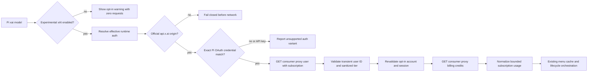

# Add xAI support to pi-usage

## Goal

Add safe, explicitly opt-in experimental OAuth-only xAI subscription usage reporting to `@narumitw/pi-usage` for Pi provider ID `xai`, while refusing API-key and custom-origin cases that cannot use the same consumer billing contract.

The opt-in defaults off so the stable package's existing provider behavior remains unchanged and the disabled state performs no xAI consumer requests.

This plan covers only the xAI portion of [issue #1051](https://github.com/narumiruna/pi-extensions/issues/1051).

## Context

Pi supports xAI inference through SuperGrok or X subscription OAuth and `XAI_API_KEY`, and both use provider ID `xai` with the official inference origin `https://api.x.ai`.

The reviewed xAI Grok Build flow sends an OAuth bearer to `https://cli-chat-proxy.grok.com/v1/user?include=subscription`, receives the proxy-canonical `userId` and optional subscription tier, and then sends that transient ID in `x-userid` to `https://cli-chat-proxy.grok.com/v1/billing?format=credits`.

The public xAI Management API requires a separate management key and team ID, so it does not satisfy `pi-usage`'s current-runtime-credential contract for inference API-key users.

The consumer proxy is first-party but not a stable public API, so implementation must pin the reviewed upstream revisions and pass an explicitly approved disposable-account protocol smoke before coding.

Because `pi-usage` is stable, xAI usage must remain unavailable until the user enables `experimentalXaiUsage` in the existing `pi-usage.json` settings after seeing a warning about the undocumented endpoint.

Authoritative evidence to revalidate:

- Pi provider and OAuth behavior: [`earendil-works/pi@e868230`](https://github.com/earendil-works/pi/tree/e86823096c5bad39e1ca282ec24bc5eb9bec745b), especially [`providers/xai.ts`](https://github.com/earendil-works/pi/blob/e86823096c5bad39e1ca282ec24bc5eb9bec745b/packages/ai/src/providers/xai.ts) and [`auth/oauth/xai.ts`](https://github.com/earendil-works/pi/blob/e86823096c5bad39e1ca282ec24bc5eb9bec745b/packages/ai/src/auth/oauth/xai.ts).
- Consumer identity and billing behavior: [`xai-org/grok-build@77cd7eb`](https://github.com/xai-org/grok-build/tree/77cd7eb675ba911c225c3aaeeece3a20cbccc426), especially [`auth/manager/enrichment.rs`](https://github.com/xai-org/grok-build/blob/77cd7eb675ba911c225c3aaeeece3a20cbccc426/crates/codegen/xai-grok-shell/src/auth/manager/enrichment.rs), [`agent/subscription_check.rs`](https://github.com/xai-org/grok-build/blob/77cd7eb675ba911c225c3aaeeece3a20cbccc426/crates/codegen/xai-grok-shell/src/agent/subscription_check.rs), [`extensions/billing.rs`](https://github.com/xai-org/grok-build/blob/77cd7eb675ba911c225c3aaeeece3a20cbccc426/crates/codegen/xai-grok-shell/src/extensions/billing.rs), and [`xai-grok-version`](https://github.com/xai-org/grok-build/blob/77cd7eb675ba911c225c3aaeeece3a20cbccc426/crates/codegen/xai-grok-version/Cargo.toml).
- API-team billing boundary: [`xai-org/xai-proto@723dd2a`](https://github.com/xai-org/xai-proto/tree/723dd2aa22d17be35617463837dc47cda008d90e), especially [`management_api/v1/billing.proto`](https://github.com/xai-org/xai-proto/blob/723dd2aa22d17be35617463837dc47cda008d90e/proto/xai/management_api/v1/billing.proto).

Applicable extension rules and verification methods:

- Authentication and transport **MUST** resolve fresh Pi runtime auth, prove an exact OAuth credential match, validate the official inference and consumer origins before sending credentials, reject redirects, forward only source-verified headers, and redact secrets; verify with focused auth, origin, transport, and redaction tests plus review.
- Asynchronous work **MUST** cancel on user dismissal, component disposal, session replacement, and shutdown, and revalidate the model, credential fingerprint, generation, and context after every `await`; verify with lifecycle, account-change, and stale-session tests plus review.
- `/usage` **MUST** retain its no-argument menu and observable non-TUI rejection without a new command route or custom component; verify with `packages/pi-usage/test/usage.test.ts`.
- Status ownership **MUST** retain the `usage` key and clear it on provider changes and shutdown; xAI remains explicit-query-only because its source is undocumented; verify with lifecycle and statusline tests.
- Experimental behavior inside the stable package **MUST** use an explicit opt-in that defaults to the existing behavior and show a user-facing experimental warning; verify disabled-state zero-request tests, enablement UI tests, and README review.
- Published behavior **MUST** include accurate README and package metadata, a minor Changeset, deterministic tests, both repository gates, a dry-run pack, and a Pi loader smoke; verify through review and the commands below.
- The existing settings runtime **MUST** keep missing and invalid settings fail-closed, preserve unknown fields, serialize writes, publish atomically, restore the previous effective value after failure, reload on session start, and flush on shutdown; verify against `docs/extension-settings.md` with settings persistence, UI rollback, lifecycle, and concurrency tests.

## Architecture

`packages/pi-usage/src/settings.ts` owns the default-off `experimentalXaiUsage` field in the existing `pi-usage.json` document and its validated, serialized, atomic persistence.

`packages/pi-usage/src/usage.ts` owns the Settings screen, experimental warning, disabled-provider filtering, setting-generation guards, and lifecycle-safe menu integration.

`packages/pi-usage/src/query.ts` owns origin policy, runtime credential resolution, approved request headers, bounded transport, enabled-adapter registration, and request-boundary revalidation.

`packages/pi-usage/src/providers/xai.ts` owns payload validation and conversion into the shared `UsageReport` model.

`packages/pi-usage/src/format.ts` presents included allowance, on-demand usage, and prepaid balance as distinct values.

## Non-Goals

- Do not add Kimi For Coding or Radius support in this change.
- Do not collect, store, or request an xAI management key or team ID.
- Do not derive account-wide API-key spend from inference response cost fields.
- Do not support custom xAI gateways or proxy origins.
- Do not add `/usage` arguments, xAI-specific commands, a second settings file, project or credential settings, environment variables, another persistence mechanism, or a new TUI component.
- Do not publish xAI usage automatically to the statusline or schedule background xAI requests.

## Unknowns

- The minimum accepted consumer-proxy headers and permitted third-party compatibility use are not documented publicly.
- A live smoke must establish whether `X-XAI-Token-Auth`, `x-grok-client-version`, and `x-grok-client-mode` are all mandatory and acceptable for `pi-usage` to send.
- Current and legacy billing responses expose period resets and monetary wrappers under different fields, so source-derived fixtures are required before normalization is final.

## Risks

- The undocumented consumer endpoint can change without notice, so the adapter must default off behind an explicit experimental opt-in with strict validation, revision pinning, a user-facing warning, and a rollback path.
- Sending an API key or proxy credential to the consumer origin would cross an authentication boundary, so provenance and origin checks must pass before the first fetch.
- The returned `userId` becomes a request header, so it must be bounded and reject controls, whitespace injection, and malformed values.
- Mixed included allowance, on-demand charges, and prepaid balance could mislead users if formatted as one quota.
- A stale query could publish another account's data unless request guards and cache keys retain the resolved credential fingerprint.

## Plan

- [ ] Revalidate the pinned Pi, Grok Build, and xAI proto revisions against current upstream source and record the selected revisions, OAuth scope, official origins, exact routes, response structs, and API-team billing boundary in an adjacent implementation comment and `packages/pi-usage/README.md`; verify by linking every reviewed source and stopping if first-party behavior no longer provides the required contract.
- [ ] Run an explicitly approved disposable-account smoke against `/v1/user?include=subscription` and `/v1/billing?format=credits` before coding to establish the minimum headers, canonical `userId`, optional tier, redirect behavior, and independence from Grok-local files or device state; verify with a sanitized request/response-shape record, or leave implementation blocked if the flow requires invented client identity or undocumented credentials.
  - Blocked as of 2026-08-27: this environment has no Pi `xai` credential or other approved xAI OAuth account for the protocol smoke.
- [ ] Create sanitized fixtures from Grok Build's `UserInfo` and `BillingConfigResponse` tests for current and supported legacy shapes without retaining real IDs, tokens, headers, or unrelated account data; verify fixtures cover canonical identity, optional and hostile tier values, included percentage, period types, legacy limits, zero wrappers, on-demand values, prepaid balance, null config, and absent fields.
- [ ] Extend `packages/pi-usage/src/settings.ts` with `experimentalXaiUsage: false` in the existing `pi-usage.json` schema and runtime, without adding project scope or another file; verify in `packages/pi-usage/test/settings.test.ts` that missing, malformed, invalid, and legacy documents default xAI off, valid toggles preserve unknown fields, saves remain ordered and atomic, failures restore the previous effective value, reloads observe the latest durable write, and shutdown flushes.
- [ ] Add a **Settings** action to the existing `/usage` menu and use Pi's `SettingsList` with `getSettingsListTheme()` in TUI mode for the existing Codex Fast preference and a new **Experimental xAI usage** row; show before activation that the undocumented integration sends the matched xAI OAuth bearer to `cli-chat-proxy.grok.com`, label the enabled state experimental, save changes immediately through the shared runtime, and give RPC mode the active settings path without entering custom UI; verify keyboard behavior, cancellation, ordered saves, rollback after persistence failure, immediate runtime application, disabled-state cache cleanup, TUI rendering, RPC notification, and unchanged observable print/JSON rejection.
- [ ] Extend `packages/pi-usage/src/types.ts` and add `packages/pi-usage/src/providers/xai.ts` to normalize validated xAI billing data into a `consumer-subscription` `UsageReport`; verify in `packages/pi-usage/test/xai.test.ts` that preferred and legacy fields, signed cent conversion, bounded values, malformed payloads, and empty display data follow the source-backed semantics.
- [ ] Update `packages/pi-usage/src/query.ts` and `packages/pi-usage/src/usage.ts` to keep `xai` out of the unconditional supported-adapter set, expose it to current/configured/all-provider discovery only while `experimentalXaiUsage` is true, require the official `https://api.x.ai` runtime origin, and match the resolved bearer to exactly one complete OAuth candidate before contacting `https://cli-chat-proxy.grok.com`; verify the default and invalid-settings states make zero xAI auth or network requests, while API keys, missing or incomplete OAuth, mismatches, duplicate equivalents, conflicting matches, account changes, proxies, and custom origins fail closed with zero unintended requests.
- [ ] Implement the identity-first xAI transport in `packages/pi-usage/src/query.ts` with fixed HTTPS URLs, protocol-gate-approved headers, a transient validated `userId`, `redirect: "error"`, bounded bodies, one end-to-end deadline, shared cancellation, and secret-safe errors; verify exact request order and headers, redirect refusal, body stalls, HTTP failures, cancellation at each boundary, stale cache exclusion, and raw payload non-retention.
- [ ] Add request-boundary guards that revalidate `experimentalXaiUsage`, its setting generation, the expected credential fingerprint, current model, session generation, context validity, and cancellation state after every `await`, including after identity, before billing, and after billing; verify opt-out, account switches, session replacement, disposal, and shutdown cannot start the next request or publish stale results.
- [ ] Update `packages/pi-usage/src/format.ts`, `packages/pi-usage/src/index.ts`, and `packages/pi-usage/test/usage.test.ts` to render xAI included allowance, period and reset, on-demand spend or cap, prepaid balance, and sanitized tier through the existing current/configured/all-provider menu; verify hostile text is sanitized, partial failures remain isolated, and `formatUsageStatusline()` returns `undefined` for xAI.
- [ ] Update `packages/pi-usage/README.md` and `packages/pi-usage/package.json` with the experimental default-off xAI setting, Settings-screen warning and RPC/manual opt-in flow, provider ID, pinned source revisions, OAuth-only semantics, official origins, displayed fields, API-key console guidance, endpoint instability, privacy boundaries, and explicit-query-only status behavior; verify the documented settings path, default, reload, persistence, and failure behavior against implementation and run the fenced-code-aware heading audit from `docs/readme-conventions.md`.
- [ ] Add a minor Changeset for `@narumitw/pi-usage` describing xAI OAuth subscription usage and its API-key limitation; verify with `npm exec changeset status`.
- [ ] Audit settings reads and writes together against `docs/extension-settings.md` for ordering, failure rollback, stale reads, invalid-file protection, unknown-field preservation, atomic publication, private permissions, reload, and shutdown flush, then audit the full diff against `docs/extension-conventions.md` and `docs/readme-conventions.md` for cancellation, disposal, session replacement, shutdown, stale setting and session state after every `await`, experimental gating, origin validation, terminal sanitization, secret redaction, and package boundaries; record deviations and unavailable live checks in the handoff.
- [ ] Run `npm --workspace @narumitw/pi-usage run build` and `npm exec vitest run -- packages/pi-usage/test/xai.test.ts packages/pi-usage/test/settings.test.ts packages/pi-usage/test/usage.test.ts packages/pi-usage/test/core.test.ts packages/pi-usage/test/generated-entry.test.ts` for the focused files, then `npm run check` and plain `npm test` for the full suite; verify the focused runner selects only the named files and all deterministic gates pass within the repository's 5,000 ms per-test limit.
- [ ] Run `npm --workspace @narumitw/pi-usage run build`, `just pack usage`, and `pi --no-extensions --no-skills -e ./packages/pi-usage --list-models`; verify generated imports resolve, the tarball contains only declared files, and Pi loads the package without making an xAI request.
- [ ] Run one explicitly approved final live smoke with a disposable or maintainer-owned Pi `/login xai` subscription account, then separately verify API-key auth makes zero consumer billing requests; verify `/usage` shows the exact account's source-backed fields without secrets and stop after one entitlement or external failure.

## Rollback / Recovery

The additive `experimentalXaiUsage` field defaults false, and older versions preserve it as an unknown field, so no destructive settings migration is required.

Before release, revert the xAI adapter, opt-in field and UI, tests, documentation, metadata, and Changeset together if source review, OAuth provenance, or either live smoke fails.

After release, ship a patch that hard-disables the xAI adapter regardless of the retained setting to stop consumer-proxy traffic while preserving other providers and user settings, and document the contract change in the release Changeset.

## Completion Checklist

- [ ] The source and protocol gates pass against recorded first-party revisions, and both approved OAuth live smokes succeed.
- [ ] Missing, invalid, and default settings keep xAI unavailable with zero xAI auth or network requests, and explicit enablement shows a user-facing experimental warning before saving.
- [ ] While the opt-in is enabled, `/usage` recognizes current and configured `xai` OAuth accounts and reports only source-backed allowance, period, reset, optional credit metrics, and sanitized tier data.
- [ ] API keys, management-key-only data, custom origins, proxies, credential mismatches, and conflicting OAuth candidates fail closed before consumer-proxy access.
- [ ] Included allowance, reset information, on-demand usage, prepaid balance, and plan tier remain semantically distinct in normalization, formatting, and documentation.
- [ ] Settings ordering, rollback, stale reads, invalid-file protection, unknown-field preservation, atomic publication, private permissions, reload, and shutdown flush have deterministic regression coverage.
- [ ] Opt-out, cache identity, cancellation, partial failures, stale settings and contexts, provider changes, shutdown cleanup, terminal sanitization, and secret redaction have deterministic regression coverage.
- [ ] xAI remains explicit-query-only and does not publish or schedule statusline usage.
- [ ] The README, metadata, exports, tests, and minor Changeset agree with the implemented behavior.
- [ ] Focused tests, `npm run check`, `npm test`, package build, dry-run pack, and Pi loader smoke pass with evidence recorded in the handoff.
