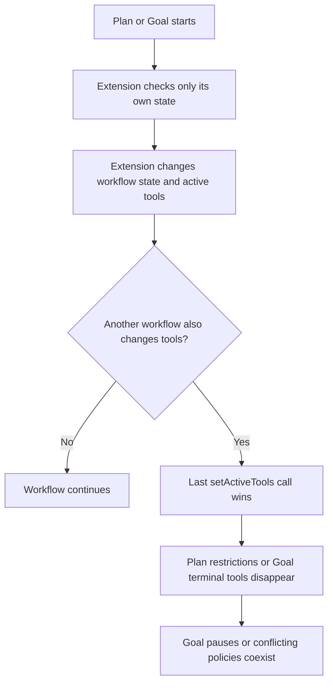
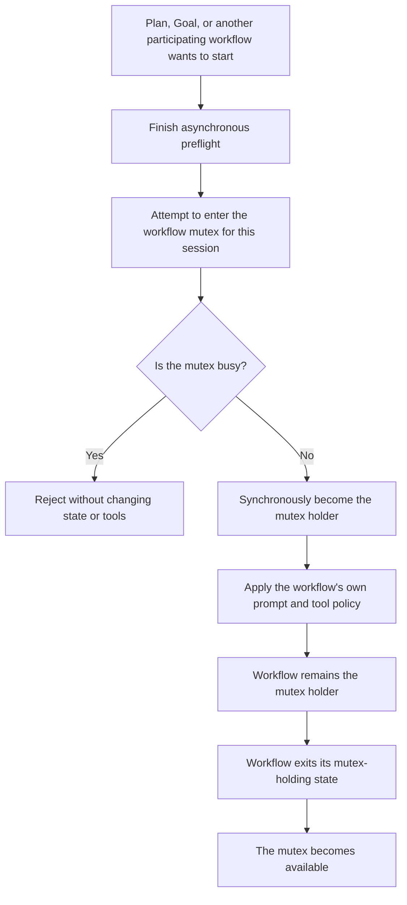

# Pi Plan and Goal Coexistence Roadmap

- **Status:** Proposed direction; not an implementation, deprecation, or release commitment.
- **Audience:** Maintainers and users of `pi-plan-mode`, `pi-goal`, and `pi-workflow`.

## Vision

Maintain two focused products: `pi-plan-mode` for collaborative planning and `pi-goal` for autonomous execution.

Let independently installed workflow extensions avoid overlapping work through one anonymous, session-scoped cooperative mutex over `pi.events`.

Retire the duplicated `pi-workflow` product only after coexistence is proven and a separate deprecation decision approves the migration.

## Objectives

- **Safe coexistence** — At most one participating agent workflow is active in one Pi session.
- **Anonymous coordination** — The protocol never identifies or requires a particular extension.
- **Independent products** — Plan and Goal remain installable and functional by themselves.
- **Minimal architecture** — No workflow engine, coordinator package, shared runtime singleton, or distributed workflow state machine is introduced.
- **No failed-start side effects** — A rejected workflow start changes no state, tools, prompt, queue, or persistent entry.
- **Evidence before deprecation** — `pi-workflow` remains active until supported Plan and Goal versions pass coexistence and migration gates.

## Current State

- `pi-plan-mode`, `pi-goal`, and `pi-workflow` are stable extensions.
- `pi-workflow` contains package-local copies of the focused Plan and Goal implementations plus combined-product behavior.
- Pi exposes one process-wide active-tool array, and `setActiveTools()` replaces the complete array.
- Plan mode temporarily applies a restrictive tool set and later restores a saved snapshot.
- Goal requires `goal_complete` and `goal_blocked`, and currently pauses instead of widening another extension's restrictive tool set.
- The existing policy is fail-safe but order-dependent and does not prevent contradictory Plan and Goal workflows from becoming active together.
- `pi.events` is process-local, returns `void`, and does not await asynchronous listeners.
- Repository guidance now permits documented, versioned, extension-neutral protocols when they identify no participant and preserve standalone behavior when no peer participates.

## Current Flow



## Target Flow



## Workflow Mutex Contract

The [Workflow Mutex Protocol v1](../api/workflow-mutex-v1.md) channel is `workflow:mutex:v1`.

An attempt contains only:

```ts
interface WorkflowMutexAttempt {
	session: object;
	group: string;
	busy: boolean;
}
```

Plan and Goal use the `agent-workflow` group.

Every participant follows these rules:

- A listener checks only its own state and sets `busy = true` when it holds the matching session and group.
- A listener never reports its identity, state schema, tools, command, or lifecycle operations.
- The listener is synchronous and performs no asynchronous work.
- A requester completes every `await` before emitting the attempt.
- A successful requester commits local ownership immediately, with no `await` between the result and the commit.
- Leaving the mutex-holding state releases local ownership.
- No listener leaves `busy` as `false`, so every extension remains functional when installed alone.

This is an advisory mutex among participating extensions, not a Pi-enforced lock or general tool-policy composition API.

## Roadmap

### Phase 1: Establish the bounded protocol

- [x] Repository guidance permits documented, versioned, extension-neutral protocols that preserve standalone behavior.
- [x] [Workflow Mutex Protocol v1](../api/workflow-mutex-v1.md) defines the channel, schema, synchronous critical section, session scoping, mutex groups, ownership states, malformed-input behavior, and version policy.
- [x] The v1 contract explicitly prohibits participant identity, workflow control, state transfer, start or cancel RPC, plan handoff, and completion forwarding.
- [x] [`test/workflow-mutex-runtime.test.ts`](../../test/workflow-mutex-runtime.test.ts) characterizes Pi `0.84.2` listener start, shared delivery, session identity, and stale-listener cleanup; the protocol explicitly excludes uncharacterized runtimes without claiming product conformance.
- [x] The v1 version policy states that pre-protocol Plan or Goal releases cannot provide guaranteed coexistence with a protocol-aware peer.

**Outcome:** Any workflow extension can implement the same small mutex without knowing which other extensions are installed.

### Phase 2: Make Plan and Goal participate

- [ ] Every transition from inactive to a Plan mutex-holding state performs final admission after all asynchronous preflight and before any state, persistence, prompt, or tool mutation.
- [ ] Every Goal activation path, including direct start, queue activation, resume, retry recovery, and restored automatic continuation, respects one documented mutex-ownership rule.
- [ ] Plan reports the mutex as busy while planning, ready, or revising, and releases it after implementation handoff, save, export-and-exit, discard, or exit.
- [ ] Goal reports the mutex as busy for every state that can execute or resume automatically and releases it only after its existing terminal, stop, clear, or non-resumable transition.
- [ ] An inactive Goal path that would widen active tools performs the same final busy check and defers its tool change while another workflow holds the group.
- [ ] Restored active state holds the mutex before it can schedule work, and an unsupported legacy collision falls back to the existing restrictive-wins pause behavior without starting autonomous work.
- [ ] A rejected start is observable in every supported command mode and preserves the exact prior state and active tools.
- [ ] Loading either package alone preserves its current commands, tools, settings, persistence, and runtime behavior.

**Outcome:** Supported Plan and Goal versions coexist without becoming active at the same time and without importing or identifying one another.

### Phase 3: Prove lifecycle and tool safety

- [ ] Co-installation tests cover both extension load orders and both acquisition orders.
- [ ] Tests cover session restore, queued Goal activation, continuation, retry, Plan ready and revision states, cancellation, replacement, reload, shutdown, and stale callbacks.
- [ ] Tests prove that a busy result never invokes `setActiveTools()`, Goal visibility changes cannot widen an active Plan tool set, and Plan restores the exact pre-Plan set when it exits.
- [ ] The current restrictive-wins Goal fail-safe remains as defense in depth for unsupported or non-participating tool policies.
- [ ] Package documentation states the minimum counterpart versions for guaranteed coexistence and distinguishes standalone support from mixed-version guarantees.
- [ ] Both repository gates, focused package tests, package dry runs, and isolated Pi loading smokes pass before release readiness is claimed.

**Outcome:** Coexistence is supported by deterministic lifecycle evidence rather than event timing assumptions alone.

### Phase 4: Decide and execute pi-workflow deprecation

- [ ] Maintainers explicitly approve deprecation after reviewing coexistence evidence, real usage, migration cost, and the loss of the atomic `/workflow` Plan-to-Goal product.
- [ ] A migration guide maps focused Plan and Goal use cases and states which combined `/workflow` behavior has no replacement.
- [ ] The deprecation plan defines its warning period, repository move, root entrypoint removal, archived tests, documentation, Changeset, and supported security or compatibility fixes.
- [ ] npm deprecation or any externally visible release action receives separate explicit approval.
- [ ] `pi-workflow` moves under `deprecated/` only after the approved warning and migration conditions are satisfied.

**Outcome:** The repository maintains the two focused extensions and preserves `pi-workflow` only as an archived reference after an evidence-backed migration.

## Success Measures

| Indicator | Required result |
| --- | --- |
| Active participating agent workflows per session | At most one |
| Participant identities in the mutex request | Zero |
| State or active-tool changes after a rejected attempt | Zero |
| Extension-to-extension imports or package dependencies | Zero |
| Standalone Plan and Goal behavior lost | Zero unapproved changes |
| Automatic Goal work started while Plan holds the group | Zero |
| Plan started while Goal holds the group | Zero |
| New workflow-engine or coordinator packages | Zero |
| `pi-workflow` deprecation before explicit approval | Never |

## Risks and Dependencies

| Risk | Response |
| --- | --- |
| `pi.events.emit()` has no awaited request-response contract | Keep every listener synchronous, characterize the installed runtime, and stop if Pi changes this behavior. |
| An `await` appears between admission and state commit | Centralize the critical section and test concurrent starts from both orders. |
| An older counterpart does not participate | Guarantee coexistence only for documented version floors and retain the current fail-safe behavior. |
| A non-participating extension changes tools or starts work | Describe the mutex as cooperative and keep existing tool-loss guards; do not claim ecosystem-wide enforcement. |
| An anonymous busy result gives limited recovery guidance | Report that another workflow is active without guessing its owner or offering cross-extension control. |
| Goal has many automatic re-entry paths | Define mutex-holding Goal states once and audit every activation and continuation boundary against them. |
| The protocol grows into workflow RPC | Keep the schema boolean and anonymous, and require a separate proposal for every additional capability. |
| Deprecation removes atomic Plan-to-Goal behavior | Treat that loss as an explicit product decision, not an automatic consequence of coexistence. |

## Non-Goals

- Create `pi-workflow-engine`, a workflow-mutex package, or a coordinator extension.
- Make Plan import Goal, Goal import Plan, or either detect the other's commands, tools, settings, events, package, or version.
- Transfer a Plan into Goal or recreate `/workflow` as a distributed event protocol.
- Identify the mutex holder or allow one extension to start, stop, resume, or cancel another.
- Replace Pi's active-tool array with a general policy engine inside this repository.
- Guarantee exclusion against extensions that do not participate in the protocol.
- Deprecate, move, publish, or npm-deprecate `pi-workflow` without the Phase 4 approvals.

## Assumptions and Unknowns

- The cooperative mutex is accepted as the long-term Plan and Goal coexistence boundary.
- Both focused extensions remain stable products with their existing public commands and persisted state.
- Mixed-version coexistence before both packages implement the protocol is unsupported rather than silently claimed safe.
- It remains unknown whether enough users depend on atomic `/workflow` behavior to retain the combined product.
- No delivery date, publication, npm deprecation, or package removal is committed.

## Decisions and Changes

- **2026-08-03 — Earlier direction:** A shared `pi-workflow-engine` and three adapters were proposed.
- **2026-08-22 — Select focused products:** Prefer maintaining `pi-plan-mode` and `pi-goal` over extracting a workflow engine.
- **2026-08-22 — Select an anonymous cooperative mutex:** Coordinate only session and mutex-group occupancy through a versioned extension-neutral `pi.events` protocol.
- **2026-08-22 — Keep the protocol minimal:** Do not expose identity or add workflow control, state synchronization, or Plan-to-Goal handoff.
- **2026-08-22 — Reject side-thread planning:** Keep the existing inline Plan architecture and its optional fresh implementation handoff.
- **2026-08-22 — Defer deprecation:** Keep `pi-workflow` active until coexistence is proven and a separate explicit decision approves its migration.
