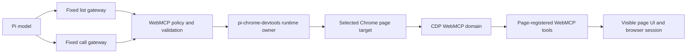

# pi-chrome-devtools WebMCP Integration Plan

## Decision

Integrate WebMCP into `packages/pi-chrome-devtools/` as an opt-in experimental capability owned by the existing Chrome runtime.

Keep the WebMCP implementation in package-internal modules rather than creating an extension-to-extension dependency.

Expose fixed Pi gateway tools and keep page-provided tool definitions in tool results instead of dynamically registering them with Pi.

Use Chrome's experimental CDP `WebMCP` domain as the production transport.

Treat `.pi/extensions/webmcp/cdp.ts` as a reviewed prototype and compatibility reference, not as the production transport or a project auto-discovered extension entrypoint.

Do not remove the prototype predecessor until a follow-up decision confirms that the packaged implementation meets the acceptance criteria.

## Why This Package Owns WebMCP

`pi-chrome-devtools` already owns endpoint discovery, external attachment, managed browser launch, active-page selection, session generation, cancellation, settings, and shutdown cleanup.

A separate WebMCP extension would either duplicate that state or depend on another extension's private runtime details.

Duplicated ownership would create competing selected-page state, duplicate browser launches, stale target handles, conflicting shutdown behavior, and two endpoint configurations.

An extension dependency would violate the repository rule that every extension remains independently installable and does not depend on another extension.

A reusable library would share code but would not provide one runtime owner across separately installed extension roots.

The integration therefore belongs beside the browser resource owner even though WebMCP is a web application protocol rather than a generic debugging feature.

## Verified Evidence

The prototype discovered page tools through `document.modelContext.getTools()` on Chrome 151.

Chrome 151 exposed the experimental CDP `WebMCP` domain through `/json/protocol` with `enable`, `disable`, `invokeTool`, and `cancelInvocation` commands.

The same protocol exposed `toolsAdded`, `toolsRemoved`, `toolInvoked`, and `toolResponded` events.

A live CDP smoke discovered seven tools on the GoogleChromeLabs Pizza Maker demo and completed `set_pizza_style` with visible Pesto and BBQ page-state changes.

A live CDP smoke discovered and called `getWorldMonitorMcpEndpoint` on `https://www.worldmonitor.app/`.

The GoogleChromeLabs Ticket Booking, Mystery Doors, React Flight Search, and Pizza Maker demos all exposed tools during the same browser session.

The current prototype required a temporary loopback proxy because it assumed port `9222` while `pi-chrome-devtools` owned a managed browser on a dynamic port.

That proxy requirement is direct evidence that endpoint and browser ownership must not remain split.

Current Chrome Origin Trial descriptors expose `inputSchema` as a JSON string and require JSON-string input for in-page `executeTool()`, while the current specification describes object input.

The reference bridge adapts that transition, but the package implementation should avoid depending on the in-page compatibility shape by using the native CDP domain.

## Product Contract

WebMCP remains experimental inside the stable `@narumitw/pi-chrome-devtools` package.

The feature defaults to disabled and preserves the package's current stable behavior until a user explicitly enables it.

Enabling WebMCP does not imply that every website supports it.

A website must register tools through a supported WebMCP implementation and remain subject to browser origin isolation, Permissions Policy, origin trial, and feature availability.

WebMCP tools operate the visible browser page and reuse its current authentication, entitlement, and UI state.

The package must not describe WebMCP as generic browser automation, backend MCP, or a way to bypass page policy.

## Architecture



The WebMCP modules should use package-internal interfaces for target resolution, endpoint readiness, session generation, and cancellation.

They must not mutate `state.activePageId` except through the existing page-selection contract.

They must not launch, close, or reconfigure a browser independently of `browser-manager.ts`.

They must not retain a page context, frame identity, invocation, or CDP session beyond its owning operation unless a later measured requirement justifies a session-owned event connection.

## Proposed Source Layout

```text
packages/pi-chrome-devtools/src/
├── browser-manager.ts
├── cdp-client.ts
├── chrome-devtools.ts
├── lazy-tools.ts
├── runtime.ts
├── settings.ts
├── tool-names.ts
├── tools.ts
└── webmcp/
    ├── protocol.ts
    ├── discovery.ts
    ├── policy.ts
    └── tools.ts
```

`protocol.ts` should own typed CDP WebMCP commands, events, feature detection, event correlation, and cancellation.

`discovery.ts` should resolve page and frame identity, normalize untrusted tool metadata, and produce bounded discovery results.

`policy.ts` should own opt-in checks, stale-definition validation, confirmation decisions, terminal sanitization, and output bounds.

`tools.ts` should define the fixed Pi gateway schemas and delegate all browser behavior to the other modules.

Keep the gateway definitions thin and preserve a first-use dynamic import boundary for the event-aware WebMCP implementation.

## Fixed Pi Tool Surface

Add `chrome_devtools_webmcp_list_tools` and `chrome_devtools_webmcp_call_tool` to the package capability catalog.

Do not create one Pi tool for each page-provided WebMCP tool.

Do not change active Pi tools in response to `toolsAdded` or `toolsRemoved` events.

Do not add `promptSnippet` or `promptGuidelines` to the WebMCP gateway tools.

The list tool should accept an optional `pageId` and default to the existing selected-or-first-page behavior.

The list result should include page ID, frame ID, frame origin, tool name, title, description, input schema, annotations, and a deterministic schema digest.

The call tool should accept page ID, frame ID, frame origin, tool name, schema digest, and a JSON object input.

The call tool should rediscover the exact tool immediately before invocation and reject when its page, frame, origin, name, schema digest, or session generation changed.

The tool identity contract should be:

```text
session generation + page target + frame ID + frame origin + tool name + schema digest
```

Page tool descriptions and schemas should appear only in the list tool result at the conversation tail.

Provider-visible Pi tool definitions must remain fixed across ordinary turns in one prefix epoch.

## CDP Transport

Extend the existing CDP client with bounded event subscription and correlation rather than creating a second WebSocket implementation.

Support command responses and events arriving in either order.

Buffer only the bounded event state required to correlate one operation.

Start operation deadlines after the WebSocket readiness handshake.

For discovery, open one page-target CDP session, enable `WebMCP`, collect the initial `toolsAdded` inventory, disable the domain when practical, and close the session.

For invocation, open one page-target CDP session, enable `WebMCP`, revalidate the tool, invoke it, wait for the matching `toolResponded`, and close the session.

Map Pi cancellation and the session controller to `WebMCP.cancelInvocation` after an invocation ID exists.

Close the CDP session even when enablement, discovery, invocation, cancellation, response parsing, or cleanup fails.

Treat target detachment, navigation, frame removal, browser replacement, and session replacement as stale-operation failures.

Feature-detect the CDP domain and return a concise unsupported-browser error when it is unavailable.

Do not silently fall back to arbitrary `Runtime.evaluate` in the first packaged implementation.

Retain the prototype's data-only expression construction and Chrome argument-shape findings as reference evidence for a separately reviewed future fallback.

## Settings and Exposure

Add a user-owned `webmcp.enabled` boolean to the existing `pi-chrome-devtools.json` document.

Default `webmcp.enabled` to `false`.

Do not allow project settings to enable WebMCP or weaken its confirmation policy.

Keep missing-file reads side-effect free.

Preserve unknown fields and block writes over malformed JSON.

Apply user setting saves in invocation order with the existing atomic publication and durability boundaries.

Show WebMCP state and its experimental label in the existing Settings, Status, Help, and tool-selection surfaces.

When WebMCP is disabled, keep both WebMCP gateway tools unavailable even if stale persisted tool names exist.

When WebMCP is enabled, let the existing tool catalog decide whether each gateway is available.

Use the existing native-deferred additive activation path on supported providers and eager exposure before the next request elsewhere.

Treat user-initiated enablement or disablement as an explicit prompt-prefix epoch transition and test the new stable baseline.

Abort an active WebMCP operation before applying disablement or replacing its browser configuration.

Do not add a new environment variable.

Do not automatically add Chrome testing flags to a managed browser in the first implementation.

Document that local non-origin-trial pages require a compatible browser started with the WebMCP testing feature.

## Security Policy

Treat page URLs, frame origins, tool names, titles, descriptions, schemas, errors, and outputs as untrusted input.

Strip terminal controls at the display boundary without mutating raw protocol payloads used for identity and validation.

Bound model-visible output to Pi's 50 KB or 2,000-line limit.

Reject schemas and outputs that exceed explicit pre-normalization size, depth, or collection-count limits.

Canonicalize accepted JSON schemas deterministically before computing their digest.

Treat WebMCP annotations as hints and never as authorization.

Allow a call without additional confirmation only when the current tool descriptor explicitly reports a read-only hint.

Require confirmation for missing, false, unknown, malformed, or changed read-only annotations.

Show the target page URL, frame origin, tool name, and a bounded sanitized input summary in the confirmation.

After confirmation, revalidate session generation, page, frame, origin, descriptor digest, browser ownership, and cancellation before invoking the tool.

Reject mutation-capable calls in print and JSON modes because they cannot provide observable confirmation.

Use standard Pi confirmation behavior in TUI and RPC modes.

Do not expose remote-debugging endpoints beyond the existing local-endpoint policy.

Display a stronger warning when attaching to a user-controlled everyday browser profile than when using an isolated managed profile.

## Lifecycle and Concurrency

Use `state.sessionController.signal` together with the Pi tool signal for every browser operation.

Do not start a WebMCP watcher, timer, socket, or browser during extension factory evaluation.

Keep discovery and invocation resources operation-scoped in the first implementation.

If concurrent calls share one page, let each invocation own its own CDP session and invocation ID unless protocol testing proves that Chrome requires serialization.

If serialization is required, scope the queue to the exact page target and keep cancellation independent for each queued request.

On `session_shutdown`, abort invocation controllers before closing the managed browser.

On `/reload`, session replacement, model replacement that changes tool exposure, browser settings changes, or managed-browser replacement, invalidate every prior WebMCP identity.

Revalidate generation and target state after every `await` that can outlive navigation, confirmation, settings publication, or browser startup.

## Implementation Phases

### Phase 1: Add event-aware CDP primitives

- [ ] Extend `cdp-client.ts` with bounded event listeners, event-before-response handling, cancellation, and idempotent close behavior.
- [ ] Add typed protocol guards for the experimental WebMCP domain without embedding a generated full CDP schema.
- [ ] Add deterministic tests for connect failure, command failure, malformed events, event ordering, timeout, abort, repeated close, and target detachment.
- [ ] Preserve every existing list, navigation, evaluation, and screenshot behavior.

**Exit criterion:** Existing Chrome DevTools tests remain green and a fake CDP target deterministically exercises one WebMCP command/event round trip.

### Phase 2: Implement discovery and invocation

- [ ] Add frame-aware discovery through `WebMCP.enable` and `toolsAdded`.
- [ ] Normalize bounded metadata and compute the schema digest.
- [ ] Add call-time rediscovery and exact identity revalidation.
- [ ] Invoke through `WebMCP.invokeTool` and correlate `toolResponded` by invocation ID.
- [ ] Forward cancellation through `WebMCP.cancelInvocation` and close every operation-owned resource.
- [ ] Register the two fixed gateway definitions without active-only prompt metadata.

**Exit criterion:** Deterministic tests cover successful discovery, successful read-only and mutation calls, stale definitions, navigation, frame removal, tool removal, tool exceptions, browser cancellation, Pi cancellation, and output truncation.

### Phase 3: Add opt-in settings and safety UX

- [ ] Extend settings normalization and persistence with user-only `webmcp.enabled`.
- [ ] Add the experimental setting to the existing settings screen and status/help summaries.
- [ ] Add both gateways to the availability menu, lazy loader search catalog, and active-tool transitions.
- [ ] Require and revalidate confirmation for every tool not explicitly marked read-only.
- [ ] Reject mutation-capable calls safely in non-interactive modes.
- [ ] Test invalid-file protection, unknown-field preservation, save ordering, rollback, project-scope rejection, reload, replacement, and shutdown.

**Exit criterion:** WebMCP remains absent from the effective capability set by default, explicit user enablement is durable, and disabling it aborts active work without affecting unrelated Chrome tools.

### Phase 4: Document, package, and smoke

- [ ] Update the package README with browser requirements, tool usage, experimental warnings, security boundaries, local testing flags, Origin Trial behavior, and troubleshooting.
- [ ] Update package keywords and changelog only when they improve discovery without implying general browser support.
- [ ] Add a minor Changeset for the new opt-in published capability.
- [ ] Build the generated runtime and validate every emitted relative import.
- [ ] Exercise a generated lazy boundary through Pi's Jiti loader.
- [ ] Pack the package and inspect the tarball.
- [ ] Run an isolated package load smoke.
- [ ] Run an opt-in live Chrome smoke against one official GoogleChromeLabs demo and one production origin-trial site when the environment supports it.

**Exit criterion:** Both repository gates, package build, generated-entry tests, package load, pack inspection, and documented live smoke evidence pass.

### Phase 5: Decide prototype retirement

- [ ] Compare packaged discovery, invocation, cancellation, reload, managed dynamic endpoint, and browser shutdown evidence with the prototype evidence.
- [ ] Confirm that no workflow still requires the project-local bridge.
- [ ] Obtain an explicit follow-up decision before deleting or deprecating the predecessor.

**Exit criterion:** The predecessor is retained or removed through a separate explicit decision with migration evidence.

## Verification Matrix

| Area | Required verification |
| --- | --- |
| Fixed Pi schemas | Compare normalized provider-visible definitions across ordinary turns and after explicit enablement establishes a new prefix epoch. |
| Native deferred loading | Verify purely additive activation at the loader result with no prompt snippet or guideline transition. |
| Eager exposure | Verify enabled gateways are present before the next request on unsupported providers. |
| Settings | Test missing, valid, malformed, invalid, unknown-field, atomic-failure, serialized-save, reload, and user-versus-project cases. |
| Lifecycle | Test cancellation, disposal, navigation, target detach, reload, new session, resume, fork, shutdown, and partial browser startup. |
| Confirmation | Test read-only bypass, missing/false annotation confirmation, cancellation, RPC behavior, and print/JSON rejection. |
| Terminal safety | Test ANSI, OSC, C0/C1, bidirectional controls, untrusted URLs, tool names, descriptions, errors, and outputs. |
| Output bounds | Test byte and line truncation before model publication and bounded retained details. |
| CDP protocol | Test initial inventory, dynamic add/remove, event ordering, invocation completion, error, cancellation, and unsupported domain. |
| Generated runtime | Build, validate imports, load through Jiti, and cross one lazy WebMCP boundary. |
| Package | Run `npm run check`, `npm test`, package build, `just pack chrome-devtools`, and isolated Pi load. |
| Live browser | Record browser version, protocol domain shape, demo URL, discovered identity, invocation input, terminal status, and visible page result. |

## Acceptance Criteria

- WebMCP is disabled by default in the stable package.
- No project setting can enable WebMCP.
- No second browser manager, endpoint setting, selected-page state, or shutdown owner exists.
- The managed browser's dynamic endpoint works without a proxy or fixed-port assumption.
- Exactly two fixed WebMCP gateway definitions are provider-visible.
- Page-provided definitions never become dynamic Pi tools.
- A call cannot execute against a stale page, frame, origin, schema, annotation, or session generation.
- Mutation-capable calls require observable confirmation.
- Pi cancellation reaches Chrome and releases the page invocation.
- Every operation-owned socket and listener is released on success, error, cancellation, replacement, and shutdown.
- Untrusted metadata and output are terminal-safe and bounded.
- Existing Chrome DevTools tools, settings, menus, lazy loading, and managed-browser behavior do not regress.
- The published package remains independently installable and contains the generated WebMCP runtime files.
- The implementation PR contains a Changeset and complete deterministic verification evidence.

## Non-Goals

- Dynamically mirror page WebMCP tools into Pi tool definitions.
- Provide backend MCP transport or MCP server discovery beyond page-returned content.
- Bypass browser origin isolation, Permissions Policy, authentication, entitlement, or user-agent policy.
- Support Firefox, Safari, Brave-specific injection, browser extensions, or Native Messaging in the first implementation.
- Add a permanent WebMCP socket or live registry before an operation-scoped design proves insufficient.
- Add project-controlled WebMCP enablement or endpoint overrides.
- Publish, tag, or dispatch a release workflow as part of the implementation PR.

## Future Split Criteria

Consider a separate `pi-webmcp` package only when users need WebMCP without general DevTools capabilities, the feature needs an independent release and security policy, or a non-CDP transport becomes a current requirement.

A future split that still shares one browser must first define an extension-neutral browser service or daemon with explicit ownership and lifecycle semantics.

Extract a reusable CDP library only after a second real consumer needs command/event transport independent of extension settings, selected-page state, and UI.

## Plan-PR Scope

This plan PR intentionally includes only this document and `.pi/extensions/webmcp/cdp.ts`.

The reference file records the proven prototype transport, cancellation, output parsing, and Chrome argument compatibility work.

The reference file has no committed project-local extension entrypoint in this PR and therefore is not an auto-discovered runnable extension by itself.

This plan PR changes no package manifest, package runtime, settings behavior, active tool definition, generated output, or published behavior.

A Changeset is therefore not required for this plan PR.
