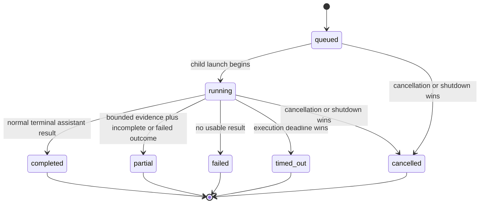

# Bounded runtime protocol

This document defines the active current-session job and completion boundary for `@narumitw/pi-subagents`.

## Ownership

The extension owns one in-memory job map for the active Pi session.

Each accepted job owns one abort controller, one terminal promise, one optional child task, and one completion-attempt marker.

The map is never persisted, restored, migrated, or shared across session managers.

Pi core owns provider execution, parent message ordering, retries, compaction, and the main conversation.

The main agent owns decomposition, fan-out, fan-in, workspace coordination, verification, and the final answer.

## Admission

A spawn validates its complete closed schema, task byte size, timeout, tool allowlist, nesting depth, model inheritance, session ownership, and active-job capacity before admission.

Admission creates one opaque job ID in `queued` state and schedules at most one child launch.

The runtime admits no more than eight `queued` or `running` jobs.

## Child boundary

A job starts one fresh Pi subprocess in the current working directory.

The child receives only its self-contained task, selected model, effective thinking level, trust decision, selected built-in tools, and inherited process environment.

The child receives no parent transcript, retained state, custom agent, extension, skill, prompt template, mailbox, broker, or communication tool.

`PI_SUBAGENT_DEPTH` is incremented for defense in depth even though unrelated extensions are disabled.

An explicit empty tool set uses `--no-builtin-tools`.

## State machine

A single terminalization operation enforces first-writer-wins behavior.

Late child output cannot rewrite cancellation, timeout, failure, or a prior completion.

Terminal summaries are pruned oldest-first after the thirty-second retained terminal job.

## Await and cancellation

`subagent_await` races the terminal promise against an optional caller deadline and optional caller abort signal.

Every path removes its timer and abort listener.

A caller deadline or abort affects only that await operation.

`subagent_cancel` commits cancellation only for non-terminal work, aborts the owned child, and waits for child cleanup.

Repeated cancellation is idempotent.

Unknown, pruned, and prior-session IDs reject.

## Completion delivery

Terminal state commits before delivery begins.

The runtime marks delivery attempted before calling `pi.sendMessage`.

Delivery uses the stable `pi-subagent-completion` custom type and `{ deliverAs: "steer", triggerTurn: false }`.

Model-visible completion content strips terminal and bidirectional controls and remains byte bounded.

A thrown delivery remains an attempted delivery and never causes result loss or a retry from await.

## Session lifecycle

Factory load registers static tools, commands, and event handlers without reading settings, querying the thinking level, or starting a child, timer, or widget.

`session_start` shuts down the previous runtime before publishing the replacement owner.

`session_shutdown` acts only on the matching session manager.

Every continuation after an await revalidates current session ownership and runtime generation before mutating state, publishing UI, or delivering completion.

Replacement and shutdown abort all active jobs, await owned cleanup, remove subscriptions and timers, clear the widget, and clear the job map.

A stale shutdown from an older session cannot close the replacement session.

## Prompt-cache boundary

The four tool names, order, descriptions, schemas, snippets, guidelines, and constrained enum values are fixed at factory registration.

No mutable setting, catalog, status, job count, or session value enters leading tool metadata.

The extension adds no context hook or mutable system-guidance block.

Ordinary turns therefore preserve the extension-owned provider-visible tool-definition prefix, without claiming a provider cache hit.

## Privacy boundary

Inspection and command status expose job IDs, states, timestamps, timeout metadata, and omission counts only.

They omit tasks, full child output, selected tools, prompts, credentials, environment variables, and legacy files.

The TUI widget may show active selected tool names because it is an explicit local active-job display.

Display text is sanitized before splitting, truncation, or terminal layout.
