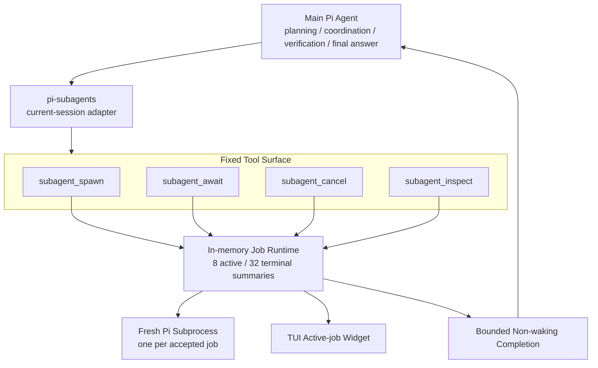
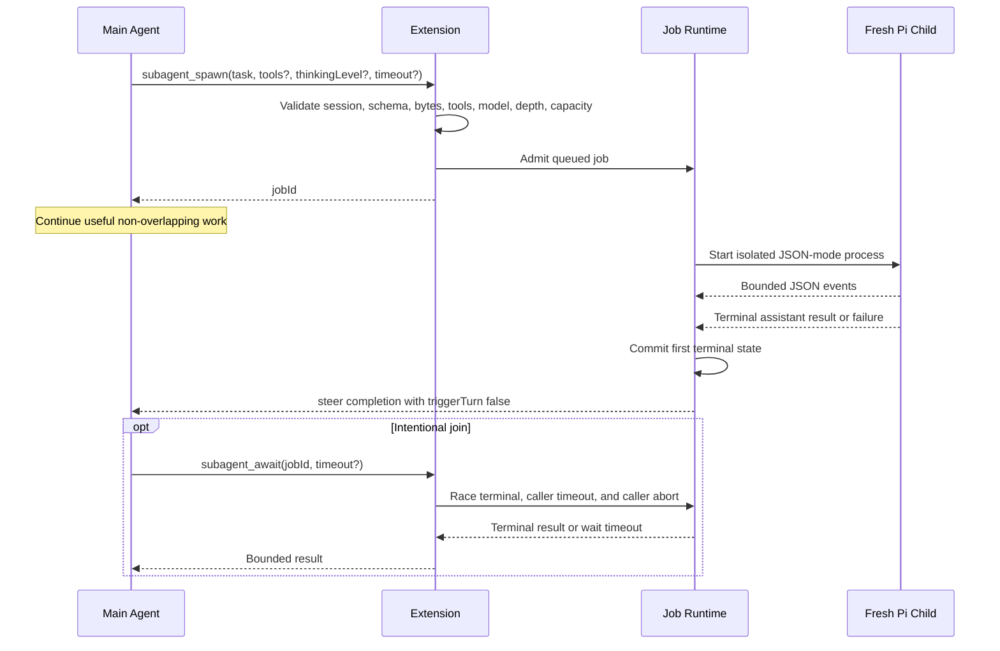
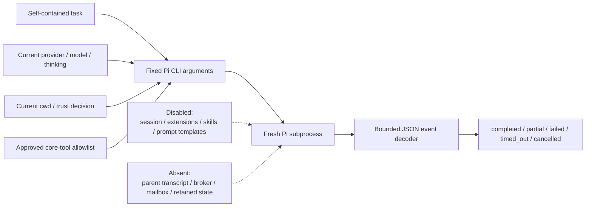
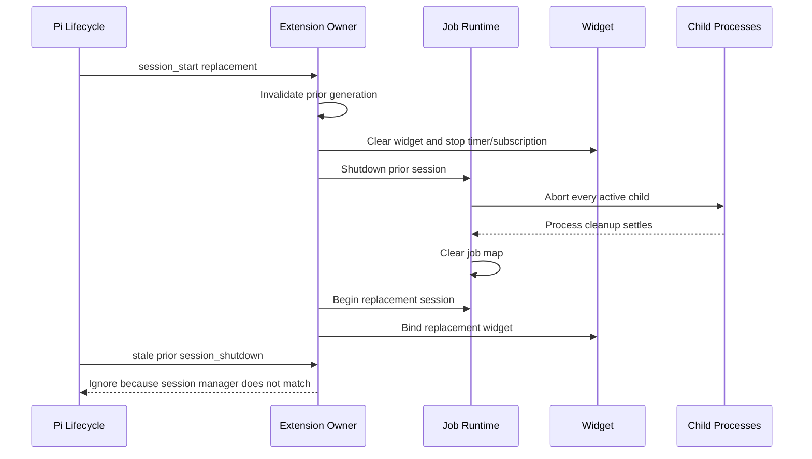

# pi-subagents architecture diagrams

These diagrams describe the bounded job surface, process boundary, and lifecycle.

## Overall architecture

## Spawn and completion

A wait timeout or caller cancellation releases only the waiter.

It never cancels the child.

## Child boundary

## Replacement and shutdown

