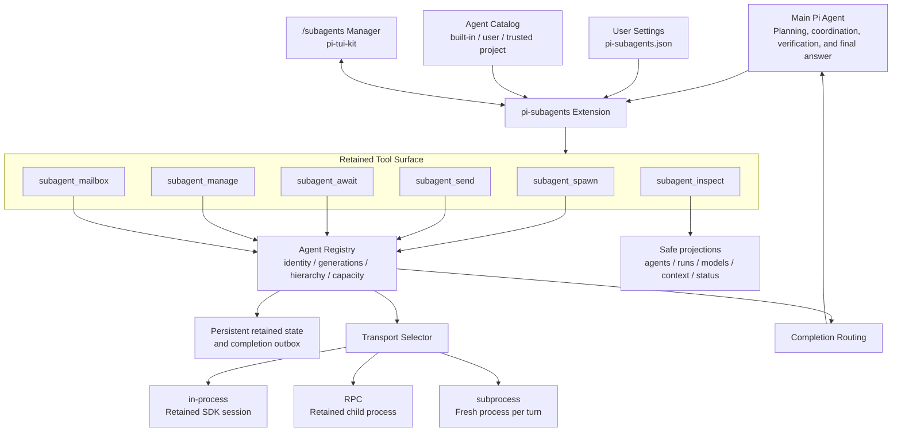
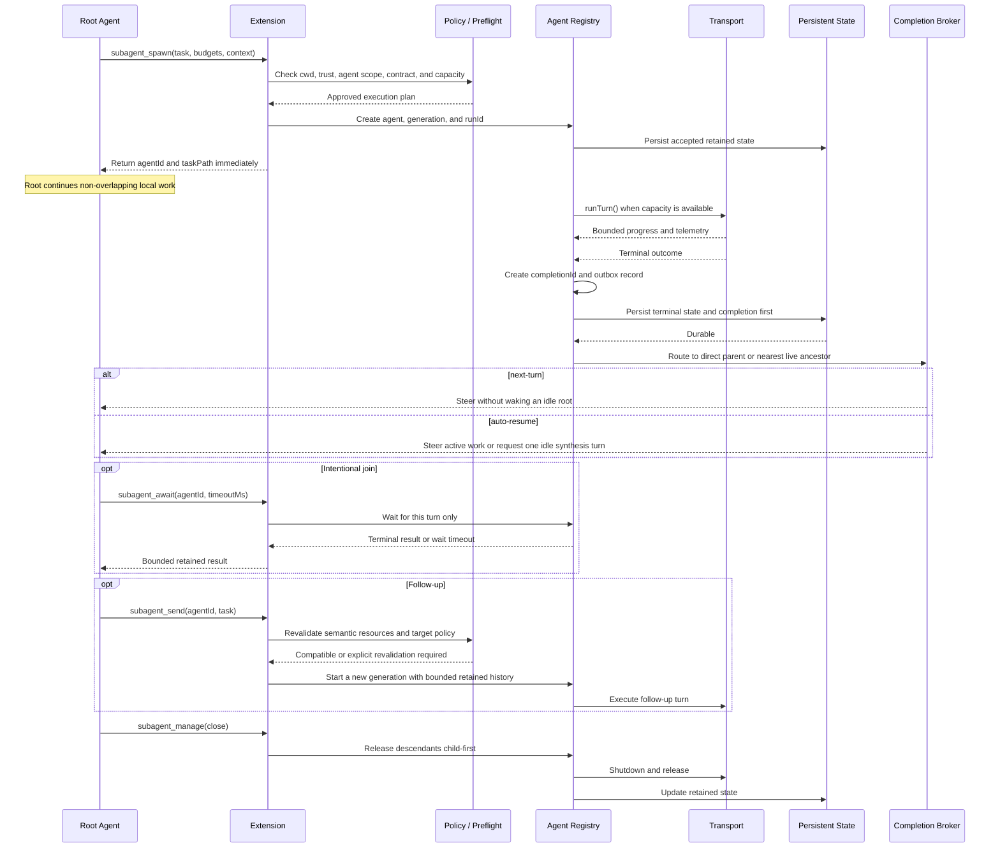
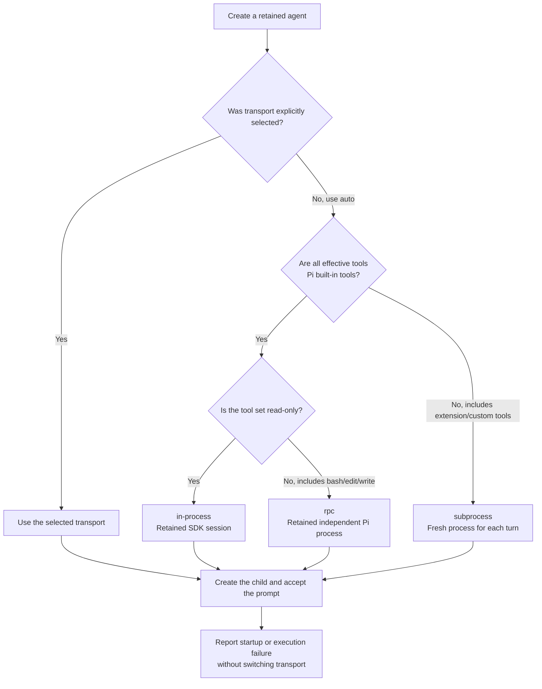

# pi-subagents Architecture Diagrams

These diagrams describe the retained-agent tool surface, completion lifecycle, and transport selection.

## Overall architecture

## Retained execution and completion delivery

A wait timeout or caller cancellation releases only the `subagent_await` waiter and never interrupts the retained turn.

The system persists each completion before notifying its parent so a process interruption does not permanently lose the result.

## Automatic transport selection

Read-only classification uses effective tool permissions rather than promises written in a task prompt.

Automatic selection never falls back after child creation or possible prompt acceptance because replay could duplicate side effects.
