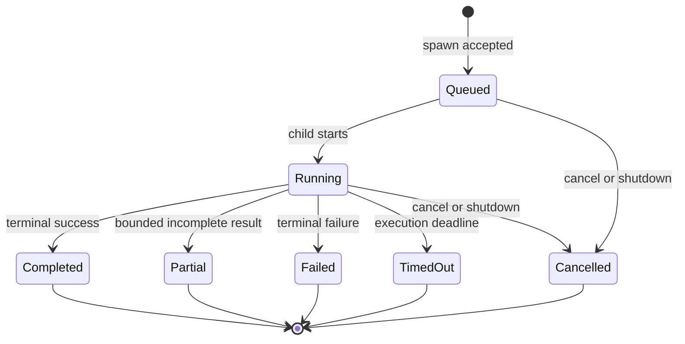

# pi-subagents simplification priorities

## Status

This document is a proposal for the next simplification of `@narumitw/pi-subagents`.

It does not describe the currently implemented retained-agent runtime.

The current behavior remains documented in [`tools.md`](./tools.md) and [`implementation-notes/pi-subagents-current-direction.md`](./implementation-notes/pi-subagents-current-direction.md).

## Summary

The target product is a bounded background-job runner rather than a retained-agent orchestration platform.

Each child should receive one self-contained task, an explicit least-privilege tool set, an inherited model, an optional thinking level, and an optional deadline.

The child should publish one terminal result and release its resources.

The main agent should continue to own planning, fan-out, fan-in, integration, deterministic verification, and the final answer.

Implementation work may proceed incrementally, but the public cutover should happen in one approved major release instead of maintaining two runtimes.

## Design principles

- Prefer one understandable execution path over configurable feature breadth.
- Treat context isolation as the primary purpose of delegation.
- Keep every task self-contained instead of copying parent conversation history.
- Define specialization in the task and authority in the selected tools.
- Keep the main agent responsible for coordination and consequential decisions.
- Keep process cleanup, cancellation, output bounds, and terminal sanitization as mandatory safety behavior.
- Do not retain state across tasks or sessions without a demonstrated product requirement.
- Do not duplicate durability, recovery, lane, fork, queue, telemetry, or usage-ledger machinery planned for Pi `AgentHarness`.
- Add a capability only when its demonstrated value exceeds its implementation, lifecycle, testing, and maintenance cost.

The experimental [`pi-subagents-v3` design principles](../../pi-subagents-v3/docs/design-principles.md) provide the immediate product reference.

The pinned [Pi Durable AgentHarness design](https://raw.githubusercontent.com/earendil-works/pi/5cfa30cc2c9efe107e322302f612c7cae56eaec2/packages/agent/docs/harness-v2.md) provides the long-term platform boundary.

## Target lifecycle

A terminal job must not become available for a later follow-up turn.

A reload or session replacement must cancel active jobs rather than restore them.

## Priority 0 — Lock the product boundary

The first change should encode the following decisions in focused tests and public migration documentation.

- A subagent is a bounded job rather than a retained conversational identity.
- Every job uses a fresh subprocess.
- Every task is self-contained and receives no parent conversation by default.
- Jobs cannot spawn nested subagents.
- Jobs do not survive reload, session replacement, shutdown, or process exit.
- The runtime does not provide workflows, panels, chains, aggregators, verification orchestration, or semantic memory.
- The extension exposes one execution path and no transport selector.
- The main agent verifies child claims against the actual workspace and deterministic checks.

These tests should be written before deleting the retained runtime so the replacement boundary remains explicit.

## Priority 1 — Keep the bounded core

| Capability | Disposition | Required behavior |
| --- | --- | --- |
| Fresh subprocess | Keep | Start one isolated Pi child process per accepted job. |
| Spawn | Keep and simplify | Accept a task, tools, thinking level, and optional timeout. |
| Await | Keep | Wait for one job without cancelling it when the wait expires or the caller cancels. |
| Cancel | Keep and simplify | Idempotently stop one queued or running job and release its resources. |
| Inspect | Keep and simplify | Return bounded job metadata without tasks, full outputs, prompts, tools, credentials, or messages. |
| Completion delivery | Keep | Publish at most one bounded terminal completion per job. |
| Tool selection | Keep | Accept only a small explicit Pi core tool allowlist. |
| Read-only default | Keep | Default to `read`, `grep`, `find`, and `ls`. |
| Model inheritance | Keep | Capture the main agent's effective provider and model at spawn time. |
| Thinking override | Keep | Default to the main agent's effective level and allow an explicit bounded override. |
| Execution timeout | Keep | Bound child execution without coupling it to await timeouts. |
| Process cleanup | Keep | Terminate the child process group during cancel, replacement, reload, and shutdown. |
| Output bounds | Keep | Limit model-visible output to Pi's documented line and byte bounds. |
| Terminal sanitization | Keep | Strip terminal and bidirectional controls at display boundaries. |
| Active-job widget | Keep | Show compact queued and running state and clear it during lifecycle transitions. |

### Recommended main-session tools

The replacement should use underscore names for continuity with the existing package.

| Tool | Purpose |
| --- | --- |
| `subagent_spawn` | Start one bounded job and return its `jobId` immediately. |
| `subagent_await` | Wait intentionally for one job to settle. |
| `subagent_cancel` | Cancel one queued or running job idempotently. |
| `subagent_inspect` | Read one bounded metadata snapshot. |

`subagent_spawn` should accept only `task`, optional `tools`, optional `thinkingLevel`, and optional `timeout`.

The public identifier should be named `jobId` because the result does not represent a retained agent identity.

## Priority 2 — Remove retained-state features

These removals provide the largest reduction in implementation and lifecycle complexity.

| Capability | Disposition | Replacement |
| --- | --- | --- |
| `subagent_send` | Remove | Spawn a new self-contained job. |
| Retained conversation history | Remove | Put required context in the new task. |
| Follow-up generations | Remove | Treat each job as one terminal execution. |
| Semantic snapshots | Remove | Use the current task and workspace state at spawn time. |
| Semantic revalidation | Remove | Start a new job after relevant resources change. |
| Persisted retained records | Remove | Keep bounded state in memory for the current session only. |
| Reload restoration | Remove | Cancel active jobs and start fresh after reload. |
| Idle retention controls | Remove | Retain only bounded terminal summaries in memory. |
| Completion requirements | Remove | Let the main agent call `subagent_await` when a result is required. |
| Session-guidance restoration | Remove | Keep stable tool descriptions and delegation guidance in the bundled skill. |

Legacy state files should remain untouched so users can still downgrade to the previous package major.

The new runtime must not read, migrate, rewrite, or delete those files.

## Priority 3 — Remove distributed orchestration features

| Capability | Disposition | Replacement |
| --- | --- | --- |
| `subagent_mailbox` | Remove | Keep coordination in the main agent. |
| Peer send and list tools | Remove | Return one terminal result to the main agent. |
| Parent-child runtime hierarchy | Remove | Let the main agent own the flat job set. |
| Canonical task paths | Remove | Address jobs only by opaque `jobId`. |
| Subtree interrupt and close | Remove | Cancel individual jobs explicitly. |
| Nested subagents | Remove | Reject spawn from child depth. |
| Depth and child limits | Remove | Keep one fixed session-wide active-job limit. |
| Workflow fan-in | Remove | Synthesize results in the main agent. |

This boundary prevents hidden peer dependencies, recursive delegation loops, and cascading lifecycle failures.

## Priority 4 — Remove transport and execution abstractions

| Capability | Disposition | Replacement |
| --- | --- | --- |
| In-process transport | Remove | Use a fresh subprocess. |
| RPC transport | Remove | Use a fresh subprocess. |
| Automatic transport selection | Remove | Use one deterministic execution path. |
| Transport settings | Remove | Expose no runtime transport choice. |
| Capability grants | Remove | Use the explicit child tool list. |
| Execution plans | Remove | Keep the plan in the main agent and task text. |
| Structured result v1 and v2 | Remove | Return bounded result, error, and limitations fields. |
| Delegation contract v2 | Remove | Keep one simple spawn schema. |

A fixed subprocess path preserves context isolation and sharply reduces the authentication, tool-resolution, cancellation, and test matrix.

Future Pi serving or Harness transport support should be adopted only after its public contract exists and the package has a concrete need.

## Priority 5 — Remove settings and manager complexity

The bounded runtime should use safe fixed defaults instead of a persistent settings matrix.

Recommended defaults are eight active jobs, thirty-two retained terminal summaries, read-only child tools, the current working directory, and no default execution timeout.

The exact retention duration should remain session-bound unless a focused product requirement justifies a time-based rule.

Remove the following settings and their persistence, validation, migration, status, and UI paths.

- Retained delegation enablement.
- Transport selection.
- Completion delivery policy.
- Agent capacity and hierarchy limits.
- Mailbox limits.
- Persistence retention.
- External working-directory policy.
- Per-agent model, thinking, timeout, and tool defaults.
- Local usage recording.

The replacement must not create a settings file during load or execution.

The existing settings file must remain untouched for downgrade compatibility.

### Command compatibility

Keep a minimal `/subagents` command during the first bounded release.

The no-argument command should show current jobs and concise status in supported modes.

`/subagents status` and `/subagents help` may remain as small compatibility routes.

Remove `/subagents settings` and the grouped settings manager as part of the approved major migration.

A later breaking release may remove the command if the widget and model tools prove sufficient.

## Priority 6 — Remove adjacent product features

### Agent catalogs

Remove built-in, user, and project agent discovery.

Remove agent scopes, project-agent confirmation, and per-agent overrides.

Use the task to define specialization and the tool list to define authority.

Put reusable delegation guidance in a bundled skill rather than runtime agent definitions.

### Worktrees

Remove extension-owned worktree creation, tracking, persistence, and cleanup.

Require the main agent, `pi-worktree`, or another explicit isolation layer to prepare isolated workspaces when needed.

The bounded runtime should execute in the current trusted working directory only.

### Usage recording

Remove the extension-owned usage JSONL recorder and its settings.

Use Pi Harness telemetry and its durable usage ledger when those public facilities become available to the coding-agent integration.

## Deferred decision — Child questions

Child-to-main questions are useful but are not part of the minimum bounded lifecycle.

The current experimental implementation requires a loopback TCP server, an ephemeral port, per-job credentials, framing, connection deadlines, long polling, request retention, and revocation.

The first simplified release should omit `subagent_ask`, child `subagent_wait`, main `subagent_reply`, and the message broker unless usage evidence demonstrates that bounded jobs regularly fail without one clarification round.

A future additive implementation should evaluate private child-process IPC before TCP.

Any replacement must prove portability through the actual Pi launch path before adoption.

## Pi Harness ownership boundary

Pi Durable `AgentHarness` is designed to own durable runs, lanes, session forks, operation logs, recovery, queues, abort reconciliation, tool replay policy, persisted model and tool state, snapshots, events, telemetry, and usage accounting.

`pi-subagents` should not build new private versions of those facilities.

Harness lanes may eventually support parallel work that intentionally shares session history.

Harness forks or newly linked child sessions may eventually support isolated subagents with deterministic parent-child identity.

A Harness fork is session-data isolation rather than an operating-system sandbox.

The pinned Harness document is still an implementation plan, and its coding-agent migration is explicitly out of scope.

The simplified subprocess runtime must therefore remain self-contained until the required Harness APIs are implemented, published, and integrated by Pi coding-agent.

No speculative Harness adapter or abstraction should be added before that point.

## Delivery sequence

### Stage 1 — Establish the replacement runtime

1. Port the smallest bounded subprocess runtime from `pi-subagents-v3` into `pi-subagents` without creating a package dependency.
2. Register only spawn, await, cancel, and inspect.
3. Preserve process cleanup, cancellation, output bounds, sanitization, trust propagation, and the active-job widget.
4. Add focused tests for every bounded lifecycle state and session transition.
5. Keep the old runtime disconnected from the entrypoint while replacement tests stabilize.

### Stage 2 — Cut over the public surface

1. Switch the package entrypoint to the bounded runtime.
2. Replace retained identifiers with `jobId` in the new public schemas and results.
3. Add migration tests and documentation for every removed tool and parameter.
4. Update the major Changeset to describe the complete outcome rather than only the synchronous-tool removal.
5. Update the README and tool reference to describe only the bounded surface.

### Stage 3 — Delete retained implementation clusters

Delete implementation and tests in dependency order.

1. Remove retained registry and persistence.
2. Remove send, mailbox, peer communication, hierarchy, and task paths.
3. Remove semantic, capability, result-contract, and completion-requirement machinery.
4. Remove in-process, RPC, and automatic transports.
5. Remove agent discovery, worktrees, settings, manager UI, and usage recording.
6. Remove obsolete benchmarks and implementation notes that describe unsupported product surfaces.

Do not retain compatibility adapters that preserve the old runtime internally.

### Stage 4 — Simplify package loading

1. Measure the reduced source entrypoint through Pi's Jiti loader.
2. Remove the generated split runtime only when the reduced source graph no longer shows a material startup penalty.
3. Change the package entrypoint and published files together if direct source loading is selected.
4. Run clean build, pack, package-directory load, trusted-project auto-discovery, and reload smokes as applicable.

## Major-release migration

The migration should happen in one approved major release because the current branch already plans a breaking tool removal.

Implementation commits may remain small and reviewable, but users should not be required to traverse an intermediate retained-only major before the bounded release.

The migration guide should provide these replacements.

| Removed behavior | Migration |
| --- | --- |
| Retained follow-up | Spawn a new self-contained job. |
| Mailbox message | Include necessary information in the new task. |
| Peer communication | Coordinate through the main agent. |
| Nested agent | Spawn independent jobs from the main agent. |
| Required completion tracking | Await the specific job before dependent work. |
| Automatic completion resume | Continue on the next main-agent turn or await explicitly. |
| Custom agent | Put the role and output contract in the task. |
| External cwd | Start Pi in the target workspace or prepare it externally. |
| Worktree mode | Prepare an isolated workspace before spawning. |
| Structured result contract | Request a concise result shape in the task and verify it in the main agent. |

Historical settings and retained-state files should be documented as ignored and preserved for downgrade compatibility.

## Acceptance criteria

The simplification is complete only when all of the following are true.

- The extension registers exactly the bounded public tool surface.
- Every accepted job starts at most one fresh child process.
- The job state machine contains only queued, running, and explicit terminal states.
- Await timeout and caller cancellation stop only the wait.
- Cancel is idempotent and terminates the child process group.
- Session replacement, reload, and shutdown cancel every active job and release every owned resource.
- Stale child continuations cannot publish state or completion into a replacement session.
- Each terminal job publishes at most one bounded completion.
- Child sessions receive no parent conversation history.
- Child sessions cannot spawn nested subagents.
- Tool selection uses an explicit allowlist and defaults to read-only tools.
- Tasks, child results, model identifiers, and paths are sanitized at display boundaries.
- Model-visible output stays within Pi's documented bounds.
- The runtime does not read or write extension settings or retained-state files.
- The runtime does not expose retained follow-up, mailboxes, peer messaging, hierarchy, worktrees, or transport selection.
- The main agent remains responsible for inspecting the actual diff and running deterministic verification.

## Verification priorities

1. Test spawn admission, model and authentication rejection, tool validation, and active-job limits.
2. Test success, partial, failure, timeout, cancellation, and process termination.
3. Test await timeout and caller cancellation without child cancellation.
4. Test replacement, reload, shutdown, repeated cleanup, and stale completion suppression.
5. Test completion at-most-once behavior and bounded inspection retention.
6. Test terminal sanitization, byte bounds, line bounds, and secret omission.
7. Test non-default keybindings and narrow rendering for the active-job widget when its behavior changes.
8. Run `npm run check` and `npm test` as separate repository gates.
9. Run the package build when a build remains configured.
10. Run package packing and Pi package-directory loading after entrypoint or publication changes.

## Explicit non-goals

- Retained conversational agents.
- Cross-session agent memory.
- Nested delegation.
- Agent Teams.
- Peer mailboxes.
- Workflow DAGs.
- Chains and fan-in aggregators.
- Extension-owned verification orchestration.
- Automatic transport selection.
- Extension-owned worktree management.
- Extension-owned durable state recovery.
- Extension-owned usage telemetry once Pi provides the required public Harness integration.
